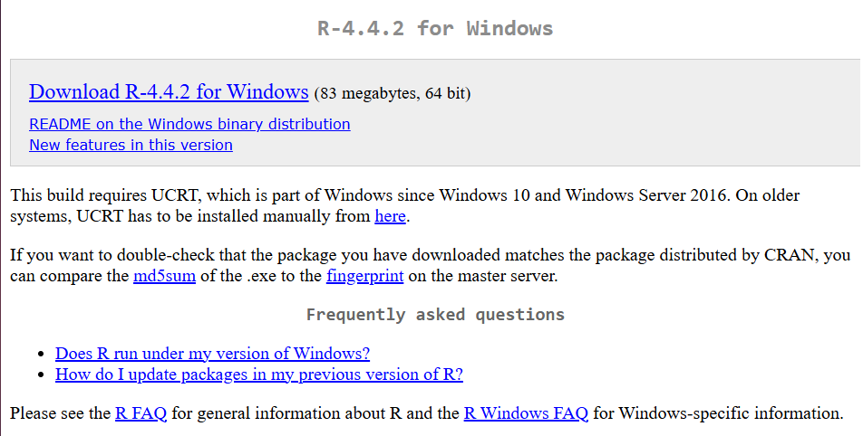
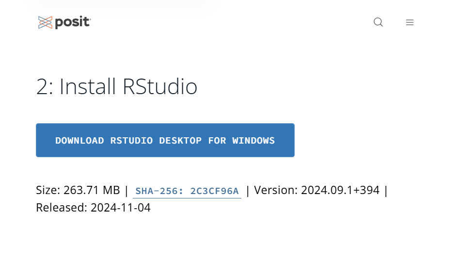
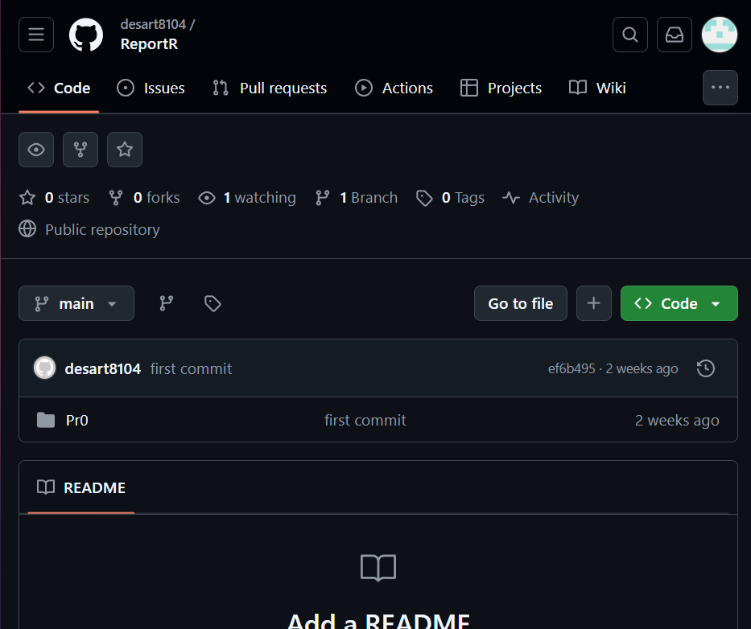
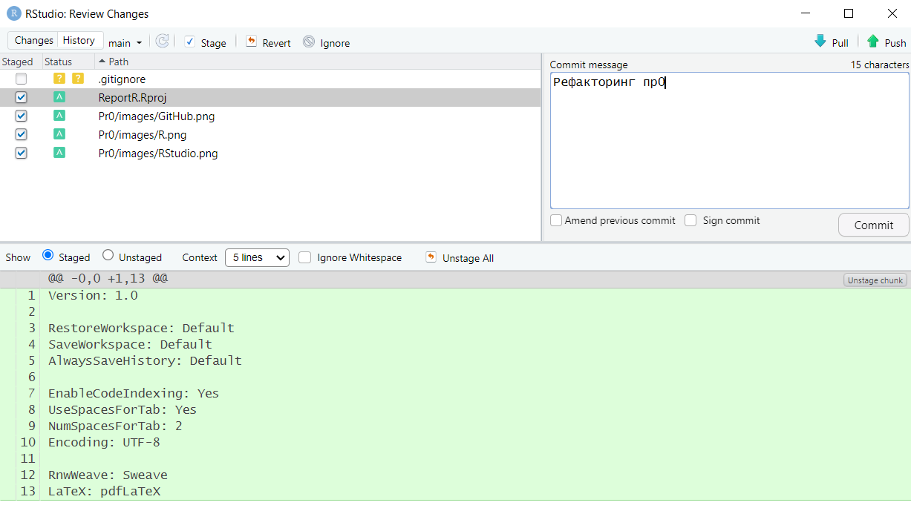

# Практическая работа №0

Подготовка воспроизводимых отчетов

## Цель работы

1.  Подготовка рабочего окружения для выполнения практических заданий
2.  Ознакомиться с синтаксисом qmd
3.  Сформировать отчет по шаблону
4.  Создать репозиторий на GitHub

## Исходные данные

1.  Ноутбук
2.  ОС Windows
3.  RStudio
4.  R
5.  Github

## Общий план выполнения

1.  Настроить окружение
2.  Создать репозиторий на GitHub
3.  Сформировать отчёт

## Содержание ЛР

### Шаг 1. Настройка окружения

**На данном шаге происходит настройка рабочего окружения**

Вначале происходит скачивание и установка R



Далее устанавливается RStudio



``` r
print('Проверка работы')
```

    [1] "Проверка работы"

### Шаг 2. Создание репозитория в GitHub

**На данном шаге происходит создание репозитория в GitHub**

На сервисе GitHub был создан репозиторий для хранения сделанных
практических работ



Далее происходит сохранение изменений



### Шаг 3. Формирование отчёта по шаблону

**На данном шаге происходит создание отчета по практической работе**

Для корректного оформления отчета, была изучена предложенная структура.

## Оценка результатов

1.  Была подготовлена и настроена для работы среда RStudio

2.  Удалось познакомиться с методом составления отчета с помощью
    Rmarkdown

3.  Была произведена работа с языком R, знакомство с основами данного
    языка и особенностями

4.  Работа успешно загружена в репозиторий GitHub

## Вывод

В результате выполнения данной работы был сформировать шаблон для
оформления дальнейших практических работ, настроено работе окружение и
создан репозиторий в GitHub
